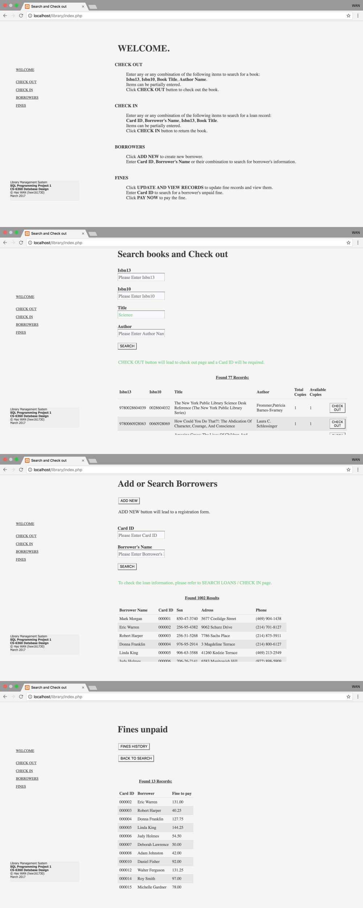

# 2017 Spring Database Design CS6360
Instructor: **Mr. Chris Davis**

This course focuses on the database software design.  
Subjects include database system architecture and models, relational and object-oriented databases, database system implementation, query processing and optimization, etc.

## What's inside the folder
This folder contains the source code for the first project of the course.

- `library` folder includes all the source code for the project.

- `library.png` is the snapshots of the user interface.

- `readme` folder includes:
   - `readme.txt`: explanations on how to run the code
   - `Quick Start user guide.pdf`: quick explanations on how to use the library management system
   - `librarydb.sql`: ready-to-import database containing 25000 records of books and 1000 records of borrowers
   - `Description.pdf`: the structure of the system, the functionalities of every php page.

- `SQL Library Project Spring 2017.pdf` is the requirement for the project.

- `books.csv` and `borrowers.csv` are the origin data given with the project requirement.

## Project: Library Management System
PHP / SQL / JavaScript / Web Application

The project is to implement a Library Management System, we should design and create a SQL database to support the system.

Detailed description is in `readme/Description.pdf`

## How to run the code
Please go to [`readme/readme.txt`](readme/readme.txt) .
